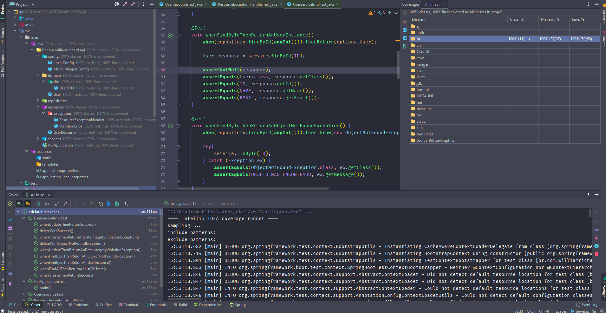

<!-- PROJECT LOGO -->
 
  <h3 align="center">Unit Testing with Spring, JUnit and Mockito</h3>

  

    Learn and learn! 
     
    <a href="https://github.com/williamrichaard/spring-unit-testing-with-junit-and-mockito"><strong>Explore the docs »</strong></a>
     
     
    <a href="https://spring-api-unit-testing-junit.herokuapp.com">View Demo API</a>
    ·
    <a href="https://github.com/williamrichaard/spring-unit-testing-with-junit-and-mockito/issues">Report Bug</a>
    ·
    <a href="https://github.com/williamrichaard/spring-unit-testing-with-junit-and-mockito/issues">Request Feature</a>
  

<!-- ABOUT THE PROJECT -->
## About The Project

  

A REST API application was developed using Java version 17 LTS, coverage tests using JUnit 5, Mockito and also integration tests with Postman.

(<a href="#top">back to top</a>)

### Built With

Here is the list of all the main frameworks / libraries used to start the project.

* [Java 17 LTS](https://www.oracle.com/java/technologies/downloads/)
* [JUnit 5](https://junit.org/junit5/)
* [Mockito](https://site.mockito.org/)
* [Lombok](https://projectlombok.org/)
* [ModelMapper](http://modelmapper.org/)
* [Spring Data JPA](https://spring.io/projects/spring-data-jpa)
* [Hibernate](https://hibernate.org/)
* [Database H2](https://www.baeldung.com/spring-boot-h2-database)
* [DTO Pattern](https://www.baeldung.com/java-dto-pattern)

(<a href="#top">back to top</a>)

<!-- CONTRIBUTING -->
## Contributing

Contributions are what make the open source community such an amazing place to learn, inspire, and create. Any contributions you make are **greatly appreciated**.

If you have a suggestion that would make this better, please fork the repo and create a pull request. You can also simply open an issue with the tag "enhancement".
Don't forget to give the project a star! Thanks again!

1. Fork the Project
2. Create your Feature Branch (`git checkout -b feature/AmazingFeature`)
3. Commit your Changes (`git commit -m 'Add some AmazingFeature'`)
4. Push to the Branch (`git push origin feature/AmazingFeature`)
5. Open a Pull Request

(<a href="#top">back to top</a>)

<!-- LICENSE -->
## License

Distributed under the MIT License. See `LICENSE.txt` for more information.

(<a href="#top">back to top</a>)

<!-- CONTACT -->
## Contact

William Richard - [Linkedin](https://www.linkedin.com/in/williamrichaard/) - wrichaard@hotmail.com

Project Link: [Unit testing with junit and mockito](https://github.com/williamrichaard/spring-unit-testing-with-junit-and-mockito)

(<a href="#top">back to top</a>)

